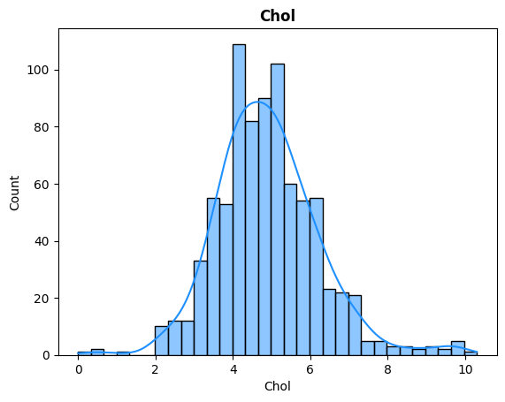

# Diabetes Prediction

## Domain Proyek


*Image Credit: Harvard Health*

Menurut laporan dari *World Health Organization (WHO)* pada tahun 2019, Diabetes merupakan penyakit ke-9 paling mematikan di dunia [1]. Menurut laporan dari *International Diabetes Federation (IDF)* tahun 2021, ada 536.6 juta orang diseluruh dunia menderita diabetes, dengan kematian sebanyak 6.7 juta orang. Di Indonesia sendiri ada 19.5 juta orang menderita diabetes dengan kematian sebanyak 236.7 ribu orang [2].

Diabetes, disebut juga sebagai penyakit gula atau kencing manis, merupakan penyakit atau kelainan yang mempengaruhi kemampuan tubuh untuk mengubah makanan menjadi energi yang disebabkan karena kekurangan hormon insulin yang berfungsi membantu tubuh mendapatkan energi dari makan. Jika dibiarkan, penyakit ini bisa menimbulkan komplikasi yang secara perlahan dapat menyerang organ penting di tubuh manusia seperti mata (kebutaan), otak (stroke), hingga gagal jantung dan gagal ginjal. Sayangnya, banyak penderita diabetes yang baru menyadari penyakitnya ketika sudah terjadi komplikasi [3].

Dalam upaya pendeteksi dini penyakit diabetes, teknologi *machine learning* telah menjadi alat yang dapat membantu dalam menganalisis dan memprediksi risiko diabetes serta pada tahap awal membantu dalam pengambilan keputusan klinis secara cepat tetapi memiliki tingkat akurasi yang tinggi, hal ini dapat membantu penderita penyakit diabetes agar dapat dengan cepat menangani penyakitnya tersebut dengan cara melakukan prediksi apakah seseorang terindikasi memiliki penyakit diabetes atau tidak sebelum terjadi komplikasi [4].

## Business Understanding

### Problem Statements

Berdasarkan kondisi yang telah di jabarkan sebelumnya, terdapat permasalahan yang ditemukan yaitu, apakah bisa mengembangkan sebuah sistem untuk melakukan prediksi yang dapat membantu menjawab permasalahan apakah seseorang terindikasi menderita penyakit diabetes atau tidak.

### Goals

Proyek ini bertujuan untuk melakukan deteksi dini dan mengetahui apakah seseorang terindikasi menderita penyakit diabetes atau tidak dengan tingkat akurasi setinggi mungkin.

### Solution statements

Solusi yang diberikan dalam proyek ini adalah dengan membuat model *machine learning* menggunakan dua atau lebih algoritma agar dapat dibandingkan dan dipilih yang nilainya tertinggi, model juga harus dapat dapat terukur menggunakan metrik evaluasi yang sesuai.

## Data Understanding

Dataset yang digunakan adalah dataset yang di publikasikan oleh Ahlam Rashid dari University of Information Technology pada 18 juli 2020, dataset ini bernama *Diabetes Dateset* yang tersedia pada platform bernama *Mendeley Data*.

Source Dataset: [Diabetes Dataset](https://data.mendeley.com/datasets/wj9rwkp9c2/1)

Menurut penyedia data, data dikumpulkan dari masyarakat Irak yang diperoleh dari laboratorium Rumah Sakit Medical City dan (Pusat Spesialisasi Endokrinologi dan Rumah Sakit Pendidikan Diabetes-Al-Kindy). Berkas pasien diambil dan data diekstrak dan dimasukkan ke dalam database untuk membangun kumpulan data diabetes. Data tersebut memiliki 1000 baris data dengan 14 atribut yang terdiri dari informasi medis dan analisis laboratorium [5].

### Variabel-variabel pada dataset diabetes adalah sebagai berikut:
**ID**\
nomor unik untuk masing-masing baris rekaman, selain itu tidak merepresentasikan apa-apa.

**No_Pation**\
Nomor pasien yang di lakukan observasi informasi medisnya, selain itu tidak merepresentasikan apa-apa.

**Gender**\
Jenis kelamin dapat berperan dalam risiko diabetes, meskipun efeknya dapat bervariasi. Misalnya, wanita dengan riwayat diabetes gestasional (diabetes saat hamil) memiliki risiko lebih tinggi terkena diabetes tipe 2 di kemudian hari. Selain itu, beberapa penelitian menunjukkan bahwa pria mungkin memiliki risiko diabetes yang sedikit lebih tinggi dibandingkan wanita.

**AGE**\
Usia, merupakan salah satu faktor risiko untuk diabetes tipe 2. Risiko terkena diabetes tipe 2 meningkat seiring bertambahnya usia, terutama setelah usia 45 tahun. Hal ini mungkin disebabkan oleh fakta bahwa seiring bertambahnya usia, orang cenderung kurang aktif secara fisik, kehilangan massa otot, dan menambah berat badan. Namun, diabetes tipe 2 semakin umum terjadi pada anak-anak, remaja, dan dewasa muda karena peningkatan jumlah obesitas pada kelompok usia ini.

**Urea, Cr**\
*Urea* dan *Creatine Ration*, merupakan produk sisa dari metabolism protein yang secara normal dipindahkan dari darah ke ginjal. Tingkat urea dan kreatinin dalam darah dapat digunakan sebagai indikator fungsi ginjal. Pada pasien diabetes, kadar urea dan kreatinin yang tinggi dapat menunjukkan adanya kerusakan ginjal akibat diabetes. Namun selain di karenakan diabetes, kadar urea dan kreatinin juga dapat dipengaruhi oleh faktor lain seperti dehidrasi, konsumsi protein tinggi, dan penggunaan obat tertentu.

**HBA1C**\
*Glycated hemoglobin*, merupakan ukuran rata-rata kadar glukosa darah selama 2-3 bulan terakhir. Ini memberikan informasi tentang kontrol gula darah jangka panjang. Tingkat *HbA1c* yang lebih tinggi menunjukkan kontrol glikemik yang lebih buruk dan berhubungan dengan peningkatan risiko diabetes dan komplikasinya.

**Chol**\
Kolesterol jahat atau *LDL* dan *VLDL* dalam tubuh dapat meningkat pada penderita diabetes, sementara tingkat kolesterol baik atau *HDL* menurun. Kolesterol jahat yang terlalu banyak, menumpuk pada dinding-dinding arteri dan membentuk plak. Penderita diabetes mengalami penumpukan glukosa dalam darah, yang dapat merusak dinding pembuluh darah dan membuat kolesterol lebih mudah menempel

**TG**\
*Triglycerides*, merupakan faktor penting karena perkembangannya seringkali mengikut penyakit diabetes, penyakit diabetes melitus tipe 1 dan tipe 2 yang tidak terkontrol merupakan salah satu penyebab trigliserida tinggi.

**HDL, LDL, VLDL**\
*High Density Lipoprotein (HDL)*, *Low Density Lipoprotein (LDL)*, *Very Low Density Lipoprotein (VLDL)*. merupakan 3 jenis kolesterol yang berbeda, ketiga jenis kolesterol ini dapat mengindikasikan penyakit diabetes pada pasien. HDL biasa dikenal sebagai kolesterol baik yang berfungsi untuk membersihkan kelebihan kolesterol yang berbahaya di dalam darah dan membawanya kembali ke hati untuk dikeluarkan dari tubuh, Sedangkan LDL dan VLDL dikenal sebagai kolesterol buruk yang membawa kolesterol dan trigliserida dari hati melalui aliran darah sehingga menumpuk pada darah, Perbedaan antara VLDL dan LDL adalah persentase dalam tiap komponen yang membentuk lipoprotein. VLDL mengandung lebih banyak trigliserida sedangkan LDL mengandung lebih banyak kolesterol.

**BMI**\
*Body Mass Index (BMI)* atau indeks massa tubuh (IMT), merupakan ukuran yang digunakan untuk menilai berat badan seseorang relatif terhadap tinggi badannya. IMT yang tinggi menunjukkan kelebihan berat badan atau obesitas, yang merupakan faktor risiko utama untuk diabetes tipe 2. Orang yang memiliki IMT tinggi cenderung memiliki lebih banyak lemak tubuh, yang dapat menyebabkan resistensi insulin dan meningkatkan risiko terkena diabetes tipe 2.

**CLASS**\
merupakan atribute target/label yang merupakan kelas penyakit diabetes dan non-diabetes

### Data Cleaning and Preprocessing

Sebelum melakukan eksplorasi data, sangat disarankan untuk melakukan pembersihan dan pemrosesan agar data yang di analisis sesuai dengan yang dibutuhkan, tanpa mengubah maksud dari data tersebut.

#### Menghapus data yang tidak diperlukan

Sahap ini dilakukan terhadap data yang tidak merepresentasikan apa-apa seperti *Unique ID*, pada data yang digunakan terdapat 2 atribut yang termasuk dalam kategori ini yaitu `ID` dan `No_Pation`, kedua atribut tersebut akan langsung dihapus dari *dataframe*. hal ini diperlukan agar hasil model yang digunakan tidak menghasilkan bias karena salah dalam membaca pola pada data.

#### Memperbaiki kesalahan entri data

Seringkali terdapat kesalahan pada data yang data yang di masukkan ke dalam database, seperti kesalahan pengetikan ataupun nilai yang tidak sesuai standar, jika hal ini dibiarkan maka data yang di olah akan menjadi bias dan tidak akurat. Maka dari itu, proses ini dirasa perlu dilakukan agar hal yang di khawatirkan dapat diminimalisir. 

pada data yang digunakan terdapat 2 atribut yang terdeteksi memiliki kesalahan data yaitu `Gender` dan `CLASS`

```
Gender: ['F', 'M', 'f']
CLASS: ['N', 'N ', 'P', 'Y', 'Y ']
```

pada atribut `Gender` di dapati memiliki nilai `f` yang di asumsikan memiliki arti *Female* seperti pada nilai `F`, nilai ini akan di ubah menjadi `F`.

pada atribut `CLASS` di dapati memiliki nilai yang `N`, `Y`, dan `P` dan lainnya memiliki nilai yang sama namun ditambah `_` atau spasi didalamnya. diasumsikan `N: No/Non diabetes`, `Y: Yes/Diabetes`, dan `P: Positive Diabetes`, maka dari itu data akan di ubah menjadi `N` dan `Y` saja.

#### Menangani data yang hilang

Data yang hilang terjadi ketika beberapa pengamatan atau nilai tidak tersedia dalam dataset yang digunakan. Hal ini dapat disebabkan oleh berbagai alasan, seperti kesalahan entri data, masalah pengumpulan data, atau data yang rusak. Menangani data yang hilang adalah langkah penting dalam proses pembersihan data karena nilai yang hilang dapat menyebabkan hasil analisis yang bias atau tidak lengkap.

pada data yang digunakan, tidak ditemukan satupun data yang hilang dari semua atribut yang tersedia, maka dalam hal ini tidak ada yang perlu di tangani.

#### Menangani data duplikat

Data duplikat dapat terjadi dalam kumpulan data karena kesalahan entri data, masalah pengumpulan data, atau masalah pemrosesan data. Mengidentifikasi dan menangani catatan duplikat penting untuk memastikan keakuratan dan konsistensi analisis pada data. 

pada tahap sebelumnya dilakukan penghapusan nilai unik pada data yang mengakibatkan munculnya data pasien berbeda yang memiliki nilai observasi yang sama, data duplikat ini akan langsung dihapus yang menjadikan baris data dari yang awalnya `1000`, menjadi `826` baris data saja.

#### Data Transformation

Tahap ini biasanya dilakukan pada proses *feature engineering*, dimana data akan diubah sehingga memiliki nilai yang berbeda dengan maksud yang sama atau membuat nilai baru yang benar-benar berbeda yang dapat membantu analisis pada data.

pada data yang digunakan terdapat 2 atribut yang akan di *encode*, yaitu proses merubah nilai kategorikal menjadi numerikal, hal ini diperlukan agar data dapat dibaca oleh model yang digunakan. data tersebut adalah `Gender` dan `CLASS`, dimana data akan diubah dengan ketentuan:
```
Gender: 'F' menjadi 0, dan 'M' menjadi 1.
CLASS: 'N' menjadi 0, dan 'Y' menjadi 1.
```

### Data Exploration

#### Univariate Analysis

*Univariate analysis* adalah metode analisis statistik yang digunakan untuk memahami dan menganalisis satu fitur pada satu waktu. Tujuan utama dari analisis univariat adalah untuk mendapatkan wawasan dan pemahaman yang mendalam tentang suatu fitur secara terpisah. Pada kasus ini digunakan diagram batang dan histogram untuk menganalisis univariat. Terdapat 2 kategori data yang di analisis univariat yaitu *Categorical* (Gender), dan *Numerical* (AGE, Urea, Cr, HbA1c, Chol, TG, HDL, LDL, VLDL, BMI).

untuk data kategorik dapat menggunakan nilai jumlah sampel dan presentase dari masing-masing datanya. untuk data numerik menggunakan beberapa nilai sebagai berikut:
- **Min**: nilai minimal, menunjukkan nilai terendah dari suatu kumpulan data.
- **Max**: nilai maksimal, menunjukkan nilai tertinggi dari suatu kumpulan data.
- **Range**: rentang nilai, menunjukkan selisih antara nilai minimum dan nilai maksimum dalam kumpulan data.
- **Mean**: nilai rata-rata dari kumpulan data.
- **Median**: nilai tengah dalam kumpulan data yang telah diurutkan.
- **Std**: *Standar Deviasi* atau nilai simpangan baku, merupakan akar kuadrat dari variansi. Standar deviasi menggambarkan seberapa jauh setiap nilai dalam kumpulan data dari mean dalam satuan yang sama dengan data asli.
- **Skewness**: nilai kemiringan, merupakan ukuran simetri distribusi data. *Skewness* positif menunjukkan bahwa distribusi condong ke kanan, dengan ekor distribusi membentang ke arah nilai yang lebih besar. *Skewness* negatif menunjukkan bahwa distribusi condong ke kiri, dengan ekor distribusi membentang ke arah nilai yang lebih kecil. *Skewness* nol menunjukkan distribusi yang simetris. rentang kemiringan yang dianggap wajar antara [-1, 1], diluar itu dianggap memiliki keimiringan yang sangat tinggi.
- **Kurtosis**: ukuran puncak atau runcingan distribusi data. Kurtosis yang lebih tinggi dari 3 disebut distribusi *leptokurtic* menunjukkan bahwa distribusi data lebih runcing dengan ekor yang lebih tebal, sementara kurtosis yang lebih rendah dari 3 disebut dengan distribusi *platikurtik* menunjukkan bahwa distribusi data lebih datar dengan ekor yang lebih tipis, kurtosis 3 menunjukkan distribusi normal atau *mezokurtic*.

Dari hasil analisis, maka diperoleh kesimpulan sebagai berikut:

- Gender

    

    Gambar 1. Analisis univariat pada fitur `Gender`

    Tabel 1. Hasil analisis univariat pada fitur `Gender`

    |            | Jumlah Sampel | Presentase |
    | ---------- | ------------- | ---------- |
    | 0 (Female) | 363           | 43.947 %   |
    | 1 (Male)   | 463           | 56.053 %   |

    Berdasarkan gambar 1 diatas, dari seluruh pasien yang dijadikan sampel, jumlah laki-laki lebih banyak dibandingkan dengan perempuan. Berdasarkan tabel 1, jumlah laki-laki memiliki presentase dari keseluruhan sampel sebanyak 56.053% dan perempuan sebanyak 43.947%.

- AGE

    

    Gambar 2. Analisis univariat pada fitur `AGE`

    Tabel 2. Analisis nilai statistik pada fitur `AGE` 

    |          | Nilai   |
    | -------- | ------- |
    | Min      | 20      |
    | Max      | 79      |
    | Range    | 59      |
    | Mean     | 53.49   |
    | Median   | 55      |
    | Std      | 8.803   |
    | Skewness | -0.811  |
    | Kurtosis | 1.446   |

    Berdasarkan gambar 2 dengan data nilai detail pada tabel 2, data pasien yang di observasi memiliki rentang usia 20 - 70 tahun, dengan rata-rata 53.49 dan nilai tengah 55, artinya dengan jarak rata-rata dan nilai tengah yang tidak terlalu jauh, hal ini didukung dengan data simpangan baku yang bernilai 8.803 yang artinya kumpulan data terbanyak berada pada rentang nilai 53.49 ±8.803 atau 44.687 - 62.293. fitur ini memiliki nilai kemiringan -0.811 dan keruncingan 1.446, artinya fitur ini memiliki distribusi yang condong ke kiri dan keruncingan yang sedikit mendekati rata.

- Urea

    

    Gambar 3. Analisis univariat pada fitur `Urea`

    Tabel 3. Analisis nilai statistik pada fitur `Urea` 

    |          | Nilai   |
    | -------- | ------- |
    | Min      | 0.5     |
    | Max      | 38.9    |
    | Range    | 38.4    |
    | Mean     | 5.185   |
    | Median   | 4.6     |
    | Std      | 9,462   |
    | Skewness | 4.259   |
    | Kurtosis | 29.197  |

    Berdasarkan gambar 3 dengan data nilai detail pada tabel 3, data pasien yang di observasi memiliki rentang urea 0.5 - 38.9, dengan rata-rata 5.185 dan nilai tengah 5.185, jarak rata-rata dan nilai tengah yang tidak terlalu jauh, namun simpangan baku berada pada 9.462 yang artinya merupakan indikasi awal memiliki distribusi yang sangat tidak normal hal ini didukung dengan nilai kemiringan 4.259 dan keruncingan 29.197, yang berarti fitur ini memiliki distribusi yang sangat condong ke kanan dan keruncingan yang sangat tinggi jauh melebihi nilai normalnya.

- Cr

    

    Gambar 4. Analisis univariat pada fitur `Cr`

    Tabel 4. Analisis nilai statistik pada fitur `Cr` 

    |          | Nilai   |
    | -------- | ------- |
    | Min      | 6       |
    | Max      | 800     |
    | Range    | 794     |
    | Mean     | 69.024  |
    | Median   | 59      |
    | Std      | 59.521  |
    | Skewness | 8.149   |
    | Kurtosis | 87.035  |

    Berdasarkan gambar 4 dengan data nilai detail pada tabel 4, data pasien yang di observasi memiliki rentang *creatine ratio* 6-800, dengan rata-rata 69.024 dan nilai tengah 59, jarak rata-rata dan nilai tengah yang cukup jauh, dan simpangan baku berada pada 59.521 yang artinya merupakan indikasi awal memiliki distribusi yang sangat tidak normal hal ini didukung dengan nilai kemiringan 8.149 dan keruncingan 87.035, yang berarti fitur ini memiliki distribusi yang sangat condong ke kanan dan keruncingan yang sangat tinggi jauh melebihi nilai normalnya.

- HbA1c

    

    Gambar 5. Analisis univariat pada fitur `HbA1c`

    Tabel 5. Analisis nilai statistik pada fitur `HbA1c` 

    |          | Nilai   |
    | -------- | ------- |
    | Min      | 0.9     |
    | Max      | 16      |
    | Range    | 15.1    |
    | Mean     | 8.326   |
    | Median   | 8.1     |
    | Std      | 6.765   |
    | Skewness | 0.183   |
    | Kurtosis | -0.340  |

    Berdasarkan gambar 4 dengan data nilai detail pada tabel 4, data pasien yang di observasi memiliki rentang *HbA1c* 0.9-16, dengan rata-rata 8.326 dan nilai tengah 8.1, jarak rata-rata dan nilai tengah yang tidak terlalu jauh jauh mengindikasikan bahwa distribusinya cukup normal, hal tersebut juga dapat dilihat dari kemiringannya yang hanya 0.183, dengan keruncingan yang cukup datar pada -0.340.

- Chol

    

    Gambar 6. Analisis univariat pada fitur `Chol`

    Tabel 6. Analisis nilai statistik pada fitur `Chol` 

    |          | Nilai   |
    | -------- | ------- |
    | Min      | 0       |
    | Max      | 10.3    |
    | Range    | 10.3    |
    | Mean     | 4.898   |
    | Median   | 4.800   |
    | Std      | 1.328   |
    | Skewness | 0.576   |
    | Kurtosis | 1.696   |

    Berdasarkan gambar 6 dengan data nilai detail pada tabel 6, data pasien yang di observasi memiliki rentang kolesterol 0-10.3, dengan rata-rata dan nilai tengah yang hampir sama 4.898 dan 4.800, jarak rata-rata dan nilai tengah yang berdekatan mengindikasikan bahwa distribusinya normal, tetapi jika dilihat dari kemiringannya 0.576 dan keruncingan 1.696, mengindikasikan distribusi data sebenarnya sedikit miring ke kenan dengan keruncingan yang sedikit datar.

- TG

    

    Gambar 7. Analisis univariat pada fitur `TG`

    Tabel 7. Analisis nilai statistik pada fitur `TG` 

    |          | Nilai   |
    | -------- | ------- |
    | Min      | 0.3     |
    | Max      | 13.8    |
    | Range    | 13.5    |
    | Mean     | 2.399   |
    | Median   | 42.015  |
    | Std      | 1.459   |
    | Skewness | 2.295   |
    | Kurtosis | 10.144  |

    Berdasarkan gambar 7 dengan data nilai detail pada tabel 7, data pasien yang di observasi memiliki rentang *Triglycerides* 0.3 - 13.8, dengan rata-rata 2.399 dan nilai tengah 2.015, jarak rata-rata dan nilai tengah yang tidak terlalu jauh, dan simpangan baku berada pada 1.459 yang mengindikasikan distribusi data cukup miring, hal ini juga dapat dilihat pada nilai kemiringan 2.295 yang artinya cukup condong ke kanan dan memiliki keruncingan yang cukup tinggi pada 10.144.

- HDL

    

    Gambar 8. Analisis univariat pada fitur `HDL`

    Tabel 8. Analisis nilai statistik pada fitur `HDL` 

    |          | Nilai   |
    | -------- | ------- |
    | Min      | 0.2     |
    | Max      | 9.9     |
    | Range    | 9.7     |
    | Mean     | 1.212   |
    | Median   | 1.1     |
    | Std      | 0.679   |
    | Skewness | 6.298   |
    | Kurtosis | 62.7    |

    Berdasarkan gambar 8 dengan data nilai detail pada tabel 8, data pasien yang di observasi memiliki rentang kolesterol baik atau *HDL* 0.2-9.9, dengan rata-rata 1.212 dan nilai tengah 1.1, jarak rata-rata dan nilai tengah yang tidak terlalu jauh, dan simpangan baku berada pada 0.629 yang artinya data rata-rata memiliki rentang nilai 0.533-1.891 atau sekitar 14% dari keseluruhan rentang data. untuk kemiringannya sendiri harus dilihat pada nilai kemiringan yang cukup tinggi pada 6.298, yang artinya kemiringan condong ke kanan, dengan keruncingan yang sangat tinggi pada 6.27. semua hal ini mengindikasikan fitur *HDL* tidak berdistribusi normal.

- LDL

    

    Gambar 9. Analisis univariat pada fitur `LDL`

    Tabel 9. Analisis nilai statistik pada fitur `HDL` 

    |          | Nilai   |
    | -------- | ------- |
    | Min      | 0.3     |
    | Max      | 9.9     |
    | Range    | 9.6     |
    | Mean     | 2.590   |
    | Median   | 2.5     |
    | Std      | 1.132   |
    | Skewness | 1.005   |
    | Kurtosis | 3.023   |

    Berdasarkan gambar 9 dengan data nilai detail pada tabel 9, data pasien yang di observasi memiliki rentang kolesterol jahat jenis *LDL* 0.2-9.9, dengan rata-rata 2.590 dan nilai tengah 2.5, jarak rata-rata dan nilai tengah yang tidak terlalu jauh, namun simpangan baku yang cukup besar pada 1.132 yang artinya data rata-rata memiliki rentang nilai 1.458 - 3.722 atau sekitar 24% dari keseluruhan rentang data. untuk kemiringannya sendiri jika dilihat pada nilai kemiringan yang sedikit diatas rentang normal yaitu pada 1.005, yang artinya kemiringan condong ke kanan, dengan keruncingan yang bisa dikatakan normal pada 3.023. semua hal ini mengindikasikan fitur *LDL* tidak berdistribusi normal.

- VLDL

    

    Gambar 10. Analisis univariat pada fitur `VLDL`

    Tabel 10. Analisis nilai statistik pada fitur `VLDL` 

    |          | Nilai   |
    | -------- | ------- |
    | Min      | 0.1     |
    | Max      | 35      |
    | Range    | 34.9    |
    | Mean     | 1.775   |
    | Median   | 1       |
    | Std      | 3.516   |
    | Skewness | 5.893   |
    | Kurtosis | 40.185  |

    Berdasarkan gambar 10 dengan nilai detail pada tabel 9, data pasien yang di observasi memiliki rentang kolesterol jahat jenis *VLDL* 0.1-35, dengan rata-rata 1.775 dan nilai tengah 1, jika dibandingkan dengan rentang datanya yaitu 34.9, jarak rata-rata dan nilai tengah dikatakan tidak terlalu jauh, namun simpangan baku yang cukup besar pada 3.516 yang artinya data rata-rata memiliki rentang nilai -1.761 - 5.271 atau sekitar 20% dari keseluruhan rentang data. untuk kemiringannya sendiri jika dilihat pada nilai kemiringan yang sangat tinggi yaitu pada 5.893, yang artinya kemiringan sangat condong ke kanan, dengan keruncingan yang sangat tinggi juga pada 40.185. semua hal ini mengindikasikan fitur *VLDL* tidak berdistribusi normal.

- BMI

    

    Gambar 11. Analisis univariat pada fitur `BMI`

    Tabel 11. Analisis nilai statistik pada fitur `BMI` 

    |          | Nilai   |
    | -------- | ------- |
    | Min      | 19      |
    | Max      | 47.75   |
    | Range    | 28.75   |
    | Mean     | 29.459  |
    | Median   | 30      |
    | Std      | 4.994   |
    | Skewness | 0.081   |
    | Kurtosis | -0.425  |

    Berdasarkan gambar 10 dengan nilai detail pada tabel 9, data pasien yang di observasi memiliki rentang *BMI* 0.1-35, dengan rata-rata 39.459 dan nilai tengah 30, jika dibandingkan dengan rentang datanya yaitu 29.459, jarak rata-rata dan nilai tengah dikatakan tidak terlalu jauh, namun simpangan baku yang cukup besar pada 4.994 yang artinya data rata-rata memiliki rentang nilai 24.465 - 34.453 atau sekitar 35% dari keseluruhan rentang data. hal ini masih cukup tinggi mengingat rentang normal *BMI* ini adalah 18.5-25. untuk kemiringannya sendiri jika dilihat pada nilai kemiringan yang hampir normal yaitu pada 0.081, yang artinya kemiringan sangat condong ke kanan namun sangat kecil, dengan keruncingan yang cenderung rata pada -0.425. semua hal ini mengindikasikan fitur *BMI* berdistribusi normal.

#### Correlation (Multivariate Analysis)


Gambar 12. Analisis korelasi pada setiap fitur terhadap target atau `CLASS`

Tabel 12. Urutan fitur yang paling berkorelasi terhadap fitur target atau `CLASS`

| No Urut | Nama Fitur | Nilai Korelasi |
| ------- | ---------- | -------------- |
| 1       | HbA1c      | 0.521619       |
| 2       | BMI        | 0.502826       |
| 3       | AGE        | 0.383285       |
| 4       | TG         | 0.253221       |
| 5       | VLDL       | 0.231634       |
| 6       | Chol       | 0.212505       |
| 7       | Gender     | 0.120338       |
| 8       | Urea       | 0.067122       |
| 9       | Cr         | 0.038377       |
| 10      | LDL        | -0.026866      |
| 11      | HDL        | -0.020759      |

Berdasarkan gambar 14 di atas, dari hasil analisis sebelumnya didapati banyak distribusi yang tidak normal, maka dari itu metode korelasi yang digunakan adalah *spearman* atau korelasi peringkat, yang merupakan teknik korelasi yang mengukur hubungan monoton antara dua variabel, Ini adalah metode nonparametrik yang tidak mengasumsikan distribusi normal dari data. untuk koefisien korelasi pada *spearman* memiliki rentang [-1, 1]. korelasi mengukur kekuatan hubungan antara dua variabel serta arahnya (positif atau negatif). Mengenai kekuatan hubungan antar variabel, semakin dekat nilainya ke 1 atau -1, korelasinya semakin kuat. Sedangkan, semakin dekat nilainya ke 0, korelasinya semakin lemah.  

fitur *HbA1c* memiliki korelasi paling tinggi dengan skor 0.521, sedangkan 2 terendah yaitu *LDL* dengan skor -0.027 dan *HDL* dengan skor -0.021. Pada tabel 12 semua nilai ini di korelasikan dengan label atau *CLASS* dan diurutkan berdasarkan nilai absolutnya. untuk selanjutnya dikarenakan fitur dan rekaman baris yang sedikit, dan tidak ingin informasi dari datanya ada yang hilang lebih banyak, diputuskan tidak ada fitur yang dihapus walaupun 4 urutan terakhir memiliki skor sangat kecil.

#### Label Distributions


Gambar 13. Analisis distribusi pada fitur target atau `CLASS`

Tabel 13. Analisis distribusi pada fitur target atau `CLASS`

|                  | Jumlah Sampel | Presentase |
| ---------------- | ------------- | ---------- |
| 0 (Non-Diabetes) | 96            | 11.622 %   |
| 1 (Diabetes)     | 730           | 88.378 %   |

Berdasarkan gambar 13 diatas, dari seluruh pasien yang dijadikan sampel, jumlah pasien penderita diabetes jauh lebih banyak dibandingkan dengan yang tidak menderita diabetes. Berdasarkan tabel 13, jumlah penderita diabetes memiliki presentase dari keseluruhan sampel sebanyak 88.378% dan non-diabetes sebanyak 11.622%.

## Feature Engineering

Berdasarkan *insight* yang diperoleh dari tahap eksplorasi data, ditemukan bahwa terdapat beberapa proses *feature engineering* yang dirasa perlu dilakukan, proses ini diharapkan dapat meningkatkan skor evaluasi pada model. Berikut berikut proses *feature engineering* yang yang dilakukan:

1. Normalisasi

    Normalisasi merupakan teknik penskalaan nilai ke rentang tertentu, biasanya [0, 1] atau [-1, 1]. Hal ini dapat membantu meningkatkan performa model *machine learning* tertentu dan memudahkan untuk membandingkan variabel dengan skala yang berbeda. proyek ini akan menggunakan teknik *MinMaxScaler* dari *library ScikitLear*.
    
    Skala default untuk *MinMaxScaler* adalah untuk mengubah skala variabel ke dalam rentang [0,1], meskipun skala yang diinginkan dapat ditentukan melalui argumen "feature_range" dan menentukan sebuah tuple, termasuk min dan max untuk semua variabel. tetapi pada proyek ini menggunakan rentang defaultnya yaitu [0,1].

    fitur-fitur yang akan dilakukan normalisasi merupakan semua fitur numerik seperti `'AGE', 'Urea', 'Cr', 'HbA1c', 'Chol', 'TG', 'HDL', 'LDL', 'VLDL', 'BMI'`. hal ini diperlukan agar fitur-fitur tersebut memiliki skala yang seragam sehingga diharapkan dapat meningkatkan performa evaluasi nantinya.

2. Train-Test Split

    Setelah banyaknya proses manipualsi data yang dilakukan seperti menghapus data yang tidak diperlukan, mengoreksi kesalahan entri data, menangani nilai yang hilang, mengatasi data duplikasi, proses encoding dari data kategorikal menjadi numerikal, dan terakhir normalisasi. semua data tersebut dianggap telah siap untuk melalui tahap modeling, namun sebelum tahap modeling dilakukan, perlu adanya proses pembagian data menjadi 2 yaitu data latih dan data uji. data latih digunakan untuk melatih model, sedangkan data uji digunakan untuk melakukan evaluasi model yang telah di latih sebelumnya. hal ini dilakukan agar dapat mengetahui apakah model dapat berjalan dengan baik atau tidak pada data baru dimana disini adalah data uji.

    proyek ini menggunakan *library train_test_split* dari *scikitlearn*, Cara kerja adalah dengan membagi data menjadi dua bagian secara acak sesuai dengan proporsi yang ditentukan melalui parameter *test_size* atau *train_size*. Pengguna juga dapat menentukan apakah data akan diacak sebelum dibagi dengan parameter *shuffle*, dan menentukan *seed* untuk pembangkit bilangan acak dengan parameter *random_state*.

    untuk parameter yang digunakan adalah *test_size* sebesar 0.2, artinya pembagiannya adalah 80% data latih dalam proyek ini sebanyak 660 dan 20% data uji yang dalam proyek ini sebayak 166. digunakan juga parameter *stratify* agar pembagian dilakukan secara merata berdasarkan banyaknya data label yang tersedia. parameter *random_state* juga digunakan agar proses pembagian di ambil secara konsisten dengan data acak yang sama pada setiap prosesnya.

3. Resampling Data for Imbalance Dataset

    Berdasarkan pada distribusi label pada tahap analisis sebelumnya, didapatkan bahwa label yang ada pada dataset yang digunakan memiliki proporsi yang tidak seimbang. untuk rekapnya dari seluruh sampel yang ada, terdapat 96 label 0 (non-diabetes) atau sekitar 11.622% dari keseluruhan data dan 730 label 1 (diabetes) atau sekitar 88.378% dari keseluruhan data. atas dasar hal tersebut, dirasa perlu untuk melakukan proses *resampling*, terdapat 2 jenis teknik *resampling* yaitu *oversampling* yang merupakan teknik peningkatkan jumlah titik data yang termasuk dalam kelas minoritas, dan *undersampling* yang merupakan teknik pengurangan jumlah titik data yang termasuk dalam kelas majoritas.

    Teknik *oversampling* digunakan pada proyek ini dengan alasan sedikitnya jumlah baris data yang ada, dikhawatirkan jika menggunakan *undersampling* akan menyebabkan hilangnya informasi yang sudah sangat sedikiti ini. teknik *oversampling* yang digunakan adalah *SMOTE (Synthetic Minority Over-sampling Technique)* dari *library scikitlearn*, *SMOTE* bekerja dengan cara mensintesis sampel baru dari kelas minoritas dari sampel yang sudah ada. Ini adalah jenis augmentasi data untuk data tabular dan dapat sangat efektif. *SMOTE* menciptakan sampel sintetis dengan cara mengambil setiap sampel kelas minoritas dan memperkenalkan variasi kecil pada vektor fiturnya dengan menggabungkannya dengan sampel kelas minoritas lain yang tetangga terdekatnya.
    
    Parameter yang digunakan:
    - `sampling_strategy`: parameter tersebut menentukan rasio yang diinginkan dari jumlah sampel di kelas minoritas dengan jumlah sampel di kelas mayoritas setelah resampling. pada proyek ini nilai `sampling_strategy` diatur sebesar 0.5 yang artinya jumlah sampel di kelas minoritas setelah resampling akan menjadi setengah dari jumlah sampel di kelas mayoritas.
    - `random_seed`: Seed untuk pengulangan yang bisa direproduksi, parameter ini mengijinkan pengulangan dilakukan dengan sama setiap kali model dijalankan sehingga hasil yang di dapatkan dapat menjadi konsisten.
    
    Proses ini menggunakan data latih, bukan data uji, karena jika digunakan pada data uji, hasil bisa jadi akan bias karena model melakukan prediksi pada data buatan ini. Data latih dari masing-masing data asli dan buatan yang didapat dari teknik ini adalah sebagai berikut:
    
    Tabel 14. Perbandingan jumlah data asli vs *SMOTE*
    
    |           | Jumlah Sampel | Jumlah Data Latih vs Uji | Presentase Data Latih vs Uji (%) |
    | --------- | ------------- | -------------------------| -------------------------------- |
    | Data Asli | 660           | 583 : 77                 | 88.333 : 11.667                  |
    | SMOTE     | 874           | 583 : 291                | 66.705 : 33.295                  |

## Modeling

Tahap ini akan mulai melakukan proses klasifikasi pada data yang telah di olah sebelumnya. klasifikasi adalah tugas *supervised learning* di mana model *machine learning* dibentuk berdasarkan data latih yang sudah diberi label kelas. Dalam kata lain, model *machine learning* harus "belajar" dari data latih untuk kemudian dapat mengklasifikasikan data baru yang belum memiliki label kelas.

Klasifikasi dalam machine learning umumnya dibagi menjadi dua jenis, yaitu:
- Klasifikasi Binomial (*Binary Classification*): Klasifikasi ini hanya melibatkan dua kelas atau kategori. Contohnya adalah deteksi spam yang membedakan antara email spam dan bukan spam.
- Klasifikasi Multiclass (*Multiclass Classification*): Klasifikasi ini melibatkan lebih dari dua kelas atau kategori. Contohnya adalah pengenalan karakter tulisan tangan yang melibatkan banyak kelas, yaitu angka 0-9 dan huruf A-Z.

Pada proyek ini akan menggunakan klasifikasi binomial (*Binary Classification*) karena kelas pada label yang tersedia hanya terdapat 2 kelas yaitu 0 (Non-Diabetes) dan 1 (Diabetes). untuk mendapatkan hasil evaluasi setinggi mungkin, diperlukan algoritma yang cocok untuk datanya, namun sangat sulit menentukan algoritma yang secara spesifik baik untuk data yang akan digunakan, oleh karena itu proyek ini akan langsung menggunakan 4 algoritma klasifikasi dan membandingkan hasil evaluasinya, berikut ke-empat algoritma tersebut:

- *Logistic Regression*

    *Logistic Regression* (Regresi logistik) merupakan salah satu algoritma klasifikasi paling sederhana dan umum digunakan untuk klasifikasi binomial. Algoritma ini menggunakan fungsi logistik untuk memprediksi probabilitas suatu objek termasuk dalam satu kelas atau kelas lain.

    Regresi logistik menggunakan fungsi logistik (sigmoid) untuk memprediksi probabilitas suatu objek termasuk dalam satu kelas atau kelas lain. Fungsi logistik memiliki bentuk berikut:

    ```
    P(y=1|x) = 1 / (1 + exp(-(w0 + w1 * x1 + w2 * x2 + ... + wn * xn)))
    ```
    Di mana:
    - P(y=1|x) adalah probabilitas objek termasuk dalam kelas 1, dengan x sebagai fitur objek.
    - w0, w1, ..., wn adalah koefisien regresi yang harus dipelajari dari data.
    - exp() adalah fungsi eksponensial.
    
    Kelebihan: 
    - Mudah diinterpretasi dan diimplementasikan
    - Parameter yang bisa dituning
    - Menghasilkan probabilitas yang berguna untuk analisis
    - Cepat dalam proses pelatihan dan prediksi

    Kekurangan: 
    - Terbatas pada asumsi linearitas antara fitur dan logit dari variabel target
    - Kurang efisien untuk klasifikasi multi-kelas (memerlukan strategi seperti one-vs-rest atau one-vs-one)
    - Kurang efektif untuk fitur kategorikal dengan banyak kategori atau ketika hubungan antara fitur dan target bersifat non-linear
    - Memerlukan pemrosesan data tambahan seperti transformasi fitur yang memiliki distribusi tidak simetris atau mengandung pencilan
    
    Parameter yang digunakan:
    - `random_state`: Seed untuk pengulangan yang bisa direproduksi, parameter ini mengijinkan pengulangan dilakukan dengan sama setiap kali model dijalankan sehingga hasil yang di dapatkan dapat menjadi konsisten.

- *Decision Tree*

    *Decision Trees* (Pohon Keputusan) merupakan metode klasifikasi yang populer dan mudah diinterpretasi. Mereka membangun struktur pohon yang berdasarkan pada fitur dan kondisi yang dipilih untuk memecah dataset menjadi kelas yang berbeda.

    Algoritma pohon keputusan bekerja dengan memilih fitur terbaik untuk memecah data dan mengulanginya secara rekursif hingga mencapai kondisi berhenti, seperti kedalaman maksimum pohon atau jumlah minimum sampel yang diperlukan untuk memecah simpul.

    Kelebihan:
    - Mudah diinterpretasi dan dijelaskan
    - Tidak memerlukan normalisasi data 
    - bisa menangani fitur kategorikal dan numerik
    - Pemrosesan awal yang minimal
    
    Kekurangan:
    - Rentan terhadap overfitting
    - Tidak cocok untuk klasifikasi linier
    - Sensitif terhadap rotasi data
    - Mungkin tidak menghasilkan pohon yang optimal secara global

    Parameter yang digunakan:
    - `random_state`: Seed untuk pengulangan yang bisa direproduksi, parameter ini mengijinkan pengulangan dilakukan dengan sama setiap kali model dijalankan sehingga hasil yang di dapatkan dapat menjadi konsisten.

- *Random Forest*

    *Random Forest* adalah metode klasifikasi yang menggabungkan kekuatan beberapa *Decision Trees* untuk menghasilkan prediksi yang lebih baik. Dalam proses ini, algoritma mengurangi varians dan overfitting yang mungkin terjadi pada *Decision Trees* tunggal.
    
    Random Forest bekerja dengan membuat sejumlah Decision Trees dan menggabungkan hasil prediksi mereka melalui metode voting. Setiap pohon dibangun dengan menggunakan bagian acak dari data latih dan fitur, proses ini dikenal sebagai 'bagging' dan 'feature randomness'.
    
    Kelebihan:
    - Mengurangi overfitting
    - bisa menangani fitur kategorikal dan numerik 
    - Memberikan *feature importance* atau fitur yang paling penting 
    - Tidak memerlukan normalisasi data
    
    Kekurangan:
    - Memerlukan lebih banyak waktu pelatihan
    - Memerlukan lebih banyak memori
    - Sulit diinterpretasi dibandingkan dengan Decision Trees tunggal
    
    Parameter yang digunakan:
    - `random_state`: Seed untuk pengulangan yang bisa direproduksi, parameter ini mengijinkan pengulangan dilakukan dengan sama setiap kali model dijalankan sehingga hasil yang di dapatkan dapat menjadi konsisten.
    
- *Extreme Gradient Boosting (XGBoost)*

    *XGBoost* merupakan peningkatan yang lebih efisien dan fleksibel dari *Gradient Boosting Machines (GBM)* yaitu generalisasi dari boosting yang meminimalkan fungsi loss yang bisa didefinisikan secara bebas. Pada setiap iterasi, model baru di-fit untuk residu model sebelumnya. Algoritma ini menggabungkan konsep boosting dan regularisasi untuk meningkatkan kinerja model. XGBoost menggunakan konsep yang sama seperti GBM namun menambahkan regularisasi L1 dan L2 pada fungsi loss.

    XGBoost bekerja dengan menambahkan *decision tree* (pohon keputusan) baru secara berulang-ulang ke dalam model. Setiap pohon baru ditambahkan untuk mengoreksi kesalahan yang dibuat oleh pohon sebelumnya. Proses ini diulang sampai model konvergen atau jumlah pohon maksimum tercapai.

    Kelebihan:
    - Merupakan algoritme yang sangat efisien, yang berarti dapat digunakan untuk melatih model pada set data yang besar.
    - merupakan algoritme yang dapat diskalakan, yang berarti dapat digunakan untuk melatih model pada sistem terdistribusi.
    - algoritma yang sangat akurat, yang berarti dapat menghasilkan prediksi yang akurat.
    
    Kekurangan:
    - merupakan algoritme yang kompleks, yang dapat membuatnya sulit untuk dipahami dan digunakan.
    - Rentan terhadap overfitting, yang berarti dapat menghasilkan model yang terlalu spesifik untuk data pelatihan.
    
    Parameter yang digunakan:
    - `random_state`: Seed untuk pengulangan yang bisa direproduksi, parameter ini mengijinkan pengulangan dilakukan dengan sama setiap kali model dijalankan sehingga hasil yang di dapatkan dapat menjadi konsisten.

Secara keseluruhan, dari ke-empat algoritma yang digunakan, semuanya hanya menggunakan parameter `random_state` saja, ini dikarenakan setelah performa model diuji, performa yang didapatkan sudah sangat tinggi sehingga parameter lain bisa diabaikan atau digunakan dengan nilai `default`.

## Evaluation

Evaluasi model klasifikasi merupakan langkah penting dalam proses pengembangan dan penilaian model *machine learning*. Pemilihan metrik yang tepat untuk mengukur kinerja model sangat penting untuk memastikan model yang akurat, relevan, dan bisa diandalkan. terdapat 4 metrik yang digunakan pada proyek ini, yaitu:

- *Accuracy*

    Akurasi adalah metrik yang paling sederhana dan intuitif. pada sisi bisnisnya, akurasi bisa cocok digunakan jika kelas dalam data seimbang dan kesalahan *false positive* dan *false negative* memiliki biaya yang sama. Akurasi menggambarkan seberapa sering model membuat prediksi yang benar. Akurasi didefinisikan sebagai:
    
    > Accuracy = (Jumlah Prediksi Benar) / (Jumlah Prediksi Benar + Jumlah Prediksi Salah)

- *Precision*

    Presisi menggambarkan seberapa baik model mengidentifikasi kelas positif. pada sisi bisnisnya presisi digunakan jika biaya *false positive* lebih tinggi daripada *false negative*. Presisi didefinisikan sebagai:

    >  Presisi = (True Positives) / (True Positives + False Positives)

- *Recall*

    *Recall* menggambarkan seberapa baik model mengidentifikasi semua kelas positif yang sebenarnya. pada sisi bisnisnya *Recall* digunakan jika biaya *false negative* lebih tinggi daripada *false positive*. *Recall* didefinisikan sebagai:
    
    > Recall = (True Positives) / (True Positives + False Negatives)

- *F1 Score*

    *F1-Score* adalah metrik yang menggabungkan presisi dan recall menjadi satu skor tunggal. pada sisi bisnisnya *F1-Score* jika kamu mencari keseimbangan antara presisi dan *recall*. *F1-Score* didefinisikan sebagai:

    > F1-Score = 2 * (Presisi * Recall) / (Presisi + Recall)

Proyek ini akan membandingkan ke-empat algoritma yang telah disebutkan dengan menggunakan 2 data sekaligus yaitu data asli dan data hasil *oversampling* dengan menggunakan *SMOTE*, sehingga total terdapat 8 skor evaluasi yang akan didapatkan. skor ini kemudian di analisis dan di cari yang paling baik.

Tabel 15. Perbandingan skor evaluasi setelah diurutkan

| No Urut | Data - Model                   | Accuracy  | Precision | Recall    | F1 Score  |
| ------- | ------------------------------ | --------- | --------- | --------- | --------- |
| 1       | SMOTE - Decision Tree          | 1.000000  | 1.000000  | 1.000000  | 1.000000  |
| 2       | SMOTE - Random Forest          | 1.000000  | 1.000000  | 1.000000  | 1.000000  |
| 3       | SMOTE - XGBoost                | 0.993976  | 0.993243  | 1.000000  | 0.996610  |
| 4       | Original - Random Forest       | 0.987952  | 0.986577  | 1.000000  | 0.993243  |
| 5       | Original - XGBoost             | 0.987952  | 0.986577  | 1.000000  | 0.993243  |
| 6       | Original - Decision Tree       | 0.987952  | 0.993197  | 0.993197  | 0.993197  |
| 7       | SMOTE - Logistic Regression    | 0.963855  | 0.986207  | 0.972789  | 0.979452  |
| 8       | Original - Logistic Regression | 0.939759  | 0.936306  | 1.000000  | 0.967105  |

Berdasarkan data pada tabel 15, dikatakan terdapat 2 model terbaik yaitu `SMOTE - Decision Tree` dan `SMOTE - Random Forest` namun, terdapat anomali dimana angka skor 1 pada semua metrik evaluasi, hal ini diasumsikan teknik *oversampling* dari *SMOTE* membuat data sintesis mungkin sama persis dengan data yang ada pada data uji, hal ini mungkin terjadi karena sangat sedikitnya data atau informasi yang tersedia, sehingga kedua model tersebut dianggap kurang *valid*. 

Maka dari itu diputuskan untuk memilih model `Original - Random Forest` sebagai model yang dianggap terbaik disini. model ini mendapatkan skor akurasi sebesar 0.987952, artinya hanya ada 1.2148% data yang gagal di identifikasi pada pasien diabetes maupun non-diabetes. skor presisi mempunyai skor sebesar 0.986577 artinya hanya ada 1.3423% model kemungkinan akan gagal mengidentifikasi pasien penderita diabetes. skor *recall* sebesar 1 artinya model berhasil sepenuhnya mengidentifikasi pasien penderita diabetes tanpa kegagalan. *F1 Score* sebesar 0.993243, artinya model tersebut mampu mengidentifikasi sebagian besar kasus diabetes dengan benar (*recall* tinggi) sambil meminimalkan jumlah prediksi penderita diabetes yang salah (presisi tinggi).

### Kesimpulan

Dengan tingginya hasil evaluasi pada model yang dikembangkan, artinya model ini bisa dibilang berhasil dan sudah sangat baik untuk dapat digunakan sebagai alat prediksi tahap awal pada pasien yang terindikasi terkena penyakit diabetes, hal ini sesuai dengan tujuan awal dalam pengembangan sistem ini. namun perlu diketahui bahwa terdapat banyak sekali variabel yang dapat merepresentasikan apakah seseorang dapat menderita penyakit diabetes selain dari yang digunakan pada proyek ini, atas hal tersebut terutama karena data yang digunakan sedikit, model akan dapat dikembangkan lebih jauh lagi untuk dapat lebih akurat lagi dalam melakukan prediksi apakah seseorang menderita diabetes atau tidak.

## Referensi

[1] World Health Organization (WHO), "The top 10 causes of death," Who, Dec. 9, 2020. https://www.who.int/news-room/fact-sheets/detail/the-top-10-causes-of-death (accessed Jul. 21, 2023).\
[2] International Diabetes Federation (IDF), "Global diabetes data report 2000 - 2045," Diabetesatlas, Nov. 8, 2021. https://diabetesatlas.org/data/en/world/ (accessed Jul. 21, 2023). \
[3] E. Triyanto, A. Isworo, and E. Rahayu, "MODEL PEMBERDAYAAN TERPADU UNTUK MENINGKATKAN KEPATUHAN PASIEN DIABETES MELLITUS", MKMI, vol. 11, no. 4, pp. 228-234, Jun. 2016. [Available](http://journal.unhas.ac.id/index.php/mkmi/article/view/528)\
[4] W. Apriliah, I. Kurniawan, M. Baydhowi and T. Haryati, "Prediksi Kemungkinan Diabetes pada Tahap Awal Menggunakan Algoritma Klasifikasi Random Forest"  Sistem Informasi, vol. 10, no. 1, Jan. 2021. [Available](http://sistemasi.ftik.unisi.ac.id/index.php/stmsi/article/view/1129)\
[5] Rashid, Ahlam (2020), "Diabetes Dataset", Mendeley Data, V1, doi: 10.17632/wj9rwkp9c2.1. [Available](https://data.mendeley.com/datasets/wj9rwkp9c2/1)